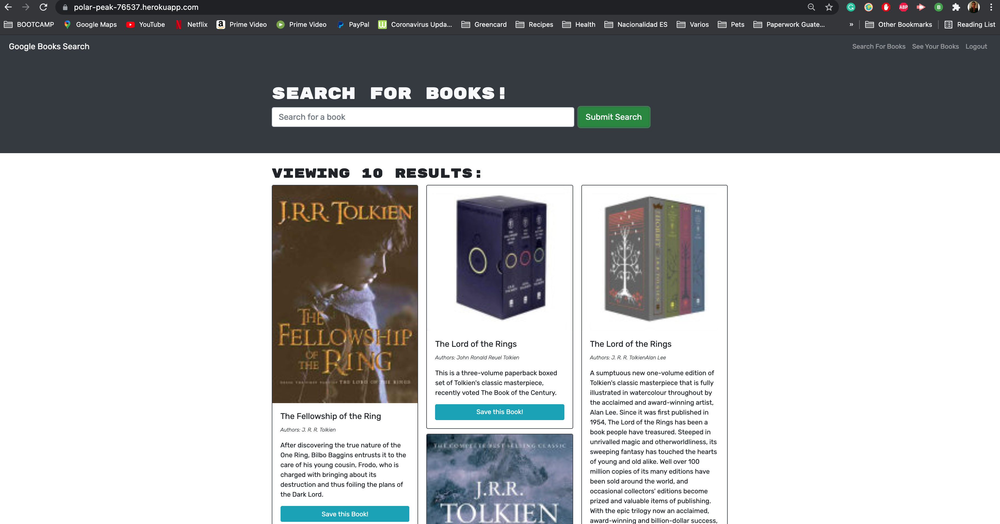

# Book Search Engine 

# Description

This app allows the user to search for books through the Google Books API. Once the user has logged in or signed up the user can save books and the user is able to see the saved book in the my books section. 

My tasks for this app were the following: 

* Set up an Apollo Server to use GraphQL queries and mutations to fetch and modify data, replacing the existing RESTful APIs.

* Modify the existing authentication middleware so that it works in the context of a GraphQL API.

* Create an Apollo Provider so that requests can communicate with an Apollo Server

## Deployed App link 

https://polar-peak-76537.herokuapp.com/

## Screenshots of the App

# Table of Contents

* [Installation](#installation)
    
* [Usage](#usage)

* [Technology](#technology)

* [License](#license)

* [Contributors](#contributors)

* [Questions](#questions)

# Installation

Visit the deployed app an search for your favorite books in the following link: https://polar-peak-76537.herokuapp.com/

# Usage

The user to search for books through the Google Books API. Once the user has logged in or signed up the user can save books and the user is able to see the saved book in the my books section. The user can also delete saved books. 

# Technology

* GraphQL
* MERN Stack
* Google Books API
* Apollo Server
* MongoDB
* MongoDB Atlas

# License 

This project is governed by: MIT License

# Contributors

Blenda Orellana

# Questions

If you have any questions about the repo or the app please feel free to contact me
 * Email: blen.or90@gmail.com
 * Github: https://github.com/blen90
